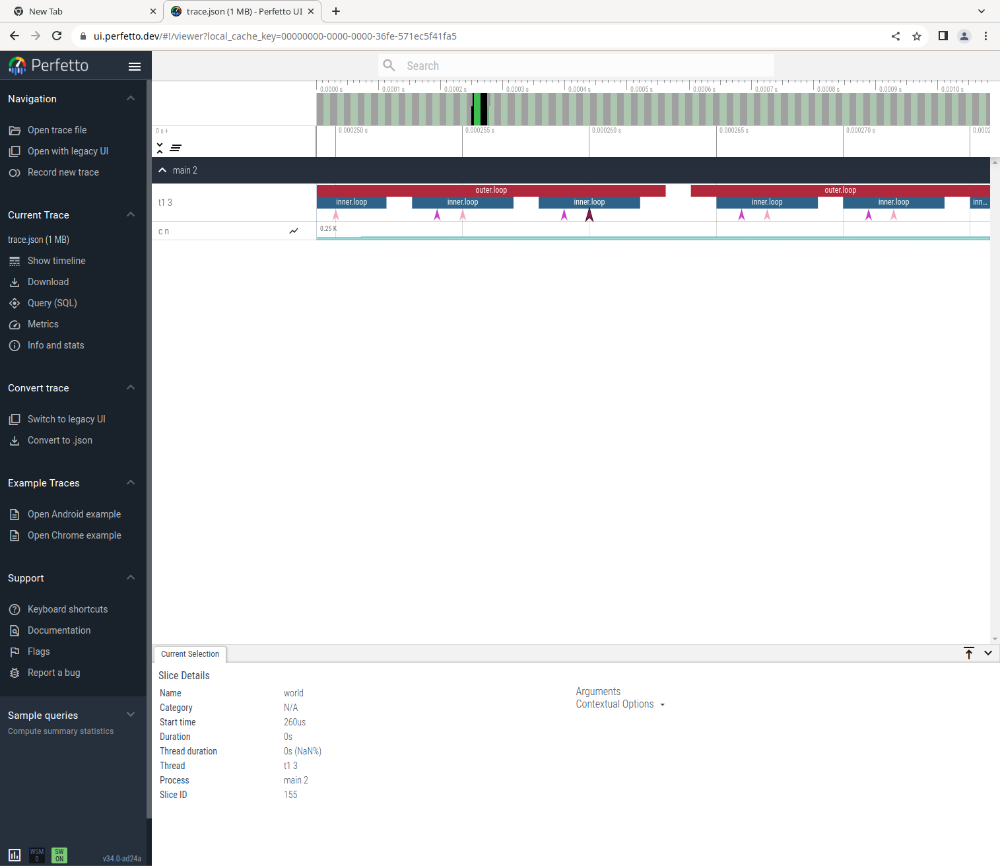

# Trace

[](https://github.com/c-cube/trace/actions/workflows/main.yml)

This small library provides basic types that can be used to instrument
a library or application, either by hand or via a ppx.

### Features

- [x] spans
- [x] messages
- [x] counters
- [ ] other metrics?

### Usage

To instrument your code, you can simply add `trace` to your dune/opam files, and then
write code like such:

```ocaml
let f x =
  Trace.with_span ~__FILE__ ~__LINE__ "inside-f" @@ fun _sp ->
  (* … code for f *)

let g x =
  Trace.with_span ~__FILE__ ~__LINE__ "inside-g" @@ fun _sp ->
  let y = f x in
  (* … code for f *)

let () =
  Some_trace_backend.setup () @@ fun () ->
  let result = g 42 in
  print_result result
```

The file `test/t1.ml` follows this pattern, using `trace-tef` as a simple backend
that emits one JSON object per span/message:

```ocaml
let run () =
  Trace.set_process_name "main";
  Trace.set_thread_name "t1";

  let n = ref 0 in

  for _i = 1 to 50 do
    Trace.with_span ~__FILE__ ~__LINE__ "outer.loop" @@ fun _sp ->
    for _j = 2 to 5 do
      incr n;
      Trace.with_span ~__FILE__ ~__LINE__ "inner.loop" @@ fun _sp ->
      Trace.messagef (fun k -> k "hello %d %d" _i _j);
      Trace.message "world";
      Trace.counter_int "n" !n
    done
  done

let () =
  Trace_tef.with_setup ~out:(`File "trace.json") () @@ fun () ->
  run ()
```

After running this, the file "trace.json" will contain something like:
```json
[{"pid":2,"name":"process_name","ph":"M","args": {"name":"main"}},
{"pid":2,"tid": 3,"name":"thread_name","ph":"M","args": {"name":"t1"}},
{"pid":2,"cat":"","tid": 3,"ts": 2.00,"name":"hello 1 2","ph":"I"},
{"pid":2,"cat":"","tid": 3,"ts": 3.00,"name":"world","ph":"I"},
{"pid":2,"tid":3,"ts":4.00,"name":"c","ph":"C","args": {"n":1}},
…
```

Opening it in https://ui.perfetto.dev we get something like this:



### Backends

Concrete tracing or observability formats such as:

- [ ] Fuchsia (see [tracing](https://github.com/janestreet/tracing))
- Catapult
  * [x] light bindings here with `trace-tef`
  * [ ] richer bindings with [ocaml-catapult](https://github.com/imandra-ai/catapult),
        with multi-process backends, etc.
- [x] Tracy (see [ocaml-tracy](https://github.com/imandra-ai/ocaml-tracy), more specifically `tracy-client.trace`)
- [x] Opentelemetry (see [ocaml-opentelemetry](https://github.com/imandra-ai/ocaml-opentelemetry/), in `opentelemetry.trace`)
- [ ] landmarks?
- [ ] Logs (only for messages, obviously)
